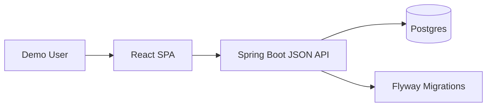
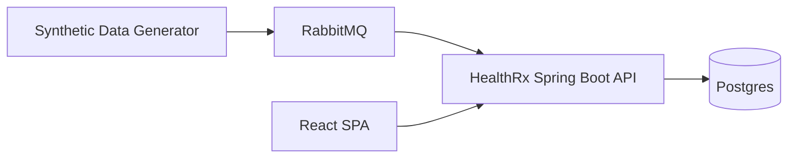
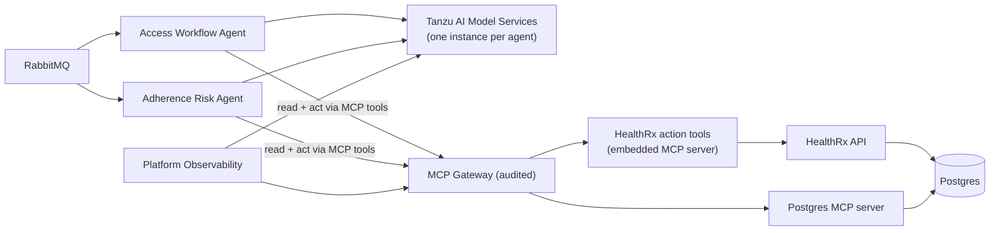
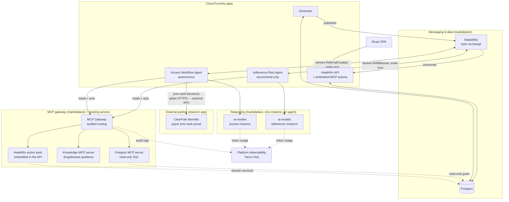

# Architecture

## Recommendation

Use a single deployable application for Phase 1:

- Spring Boot JSON API backend.
- React/Vite frontend.
- Frontend builds to static assets served by Spring Boot.
- Postgres marketplace service bound to the app.
- Flyway migrations for schema and reproducible seed data.

This gives HealthRx a clean separation between API and UI code while keeping deployment simple. The app can be split into separate frontend and backend apps later if independent scaling, routing, or team ownership becomes useful.


## Logical Components



Phase 2 adds a synthetic data generator and RabbitMQ. **Implemented** (see
[phase-2-design](phase-2-design.md)): the generator is a second CF app publishing an ambient event
stream to RabbitMQ; the API consumes it idempotently; a shared simulated clock lets the world age
on fast-forward; a Simulation control panel (proxied through the API) drives it.



Phase 3 adds agent apps, model services, and the MCP gateway (full design:
[phase-3-design](phase-3-design.md)):



## Full System Architecture (As Built)

Phases 1-3 are all implemented and deployed. This is the complete picture — seven Cloud Foundry
apps and five marketplace service instances — in one diagram, superseding the incremental
per-phase sketches above (kept for their historical narrative).



Notes that don't fit neatly into the boxes above:

- **The payer portal is deliberately outside the MCP/gateway world.** ClearPath Benefits is a
  stand-in for a real external company (an insurance clearinghouse), so the Access Workflow
  Agent calls its REST API over plain HTTPS — external partners don't sit behind your MCP
  gateway. Everything the agent then does *inside* HealthRx with the payer's answer (recording
  the decision, routing an appeal task) still goes through the audited gateway tools
  (`record_prior_auth_decision`, `create_task`). The portal binds no HealthRx services.
- **PA submissions reach the agent three ways**: the generator's ambient stream and the
  `submit-prior-auth` scenario publish `PriorAuthorizationSubmitted` directly, and the API
  re-broadcasts the same event when a *human* advances a referral into PA-submitted from the UI
  (only for human actors — consumer-applied and agent-driven transitions don't re-publish, which
  is what prevents duplicate agent runs).

- **One `ai-models` instance per agent, not shared** — so token usage/latency attribute per
  agent on the platform dashboards, not just per app.
- **Binding an app to the MCP gateway *is* how it registers** — that's why exactly three apps
  (`healthrx`, `healthrx-knowledge-mcp`, `healthrx-postgres-mcp-server`) sit behind it, each
  under its own `/<app-name>/mcp` path, and nothing else calls them directly.
- **Agents have no direct Postgres binding, by design** — every read and write goes through the
  gateway as an audited MCP tool call. The Postgres MCP server and HealthRx's embedded action
  server both ultimately touch the same database (via a read-only grant for the former, the
  existing domain services for the latter), which is why both are shown reaching into Postgres
  even though agents never do so directly.
- **Interim auth**: agent identity at the gateway is carried by an `X-Agent-Id` / `X-Agent-Key`
  header pair rather than a token, until an SSO/OIDC service is confirmed available (see
  [phase-3-design](phase-3-design.md) §4) — same audited path either way.
- `ai-models` reports token usage/latency straight to the same platform observability dashboards
  the gateway's audit logs land in — two feeds, one destination.

Full component-by-component detail (data model, event vocabulary, guardrails, build/deploy) lives
in [phase-2-design](phase-2-design.md) and [phase-3-design](phase-3-design.md); a from-scratch
deploy walkthrough is in [deploy-from-scratch](deploy-from-scratch.md).

## Suggested Repository Layout

```text
HealthRx/
  README.md
  docs/
  backend/
    build.gradle
    src/main/java/...
    src/main/resources/
      application.yml
      db/migration/
  frontend/
    package.json
    src/
    vite.config.ts
  manifest.yml
  scripts/
```

The final structure can change once implementation starts, but the important idea is to keep UI and API source code separate while producing one Cloud Foundry app artifact.

## Backend

Recommended backend stack:

- Java 17 for the first build, with an easy later move to Java 21 if every target foundation supports it.
- Spring Boot.
- Spring Web for JSON APIs.
- Spring Data JDBC.
- Flyway for database migrations.
- PostgreSQL driver.
- Spring Boot Actuator.

Spring Data JDBC is the Phase 1 default because the domain model is small, relationship traversal is explicit, and the app does not need complex ORM behavior. If the Shields Spring team strongly prefers JPA later, the repository layer should be the only planned swap point.

## Frontend

Recommended frontend stack:

- React.
- Vite.
- TypeScript.
- TanStack Query for API state.
- A lightweight component approach using CSS modules or plain CSS.

Avoid a heavy enterprise UI framework unless it materially speeds up implementation. HealthRx should feel polished, but not over-engineered.

## Single App Build

The production artifact should be built from the repository root:

```text
./gradlew clean build
```

Build responsibilities:

- Gradle invokes the Vite production build.
- Vite writes compiled assets to `frontend/dist`.
- Gradle copies `frontend/dist` into the Spring Boot static resources included in the boot jar.
- Spring Boot serves `/api/**` from controllers and static frontend assets from the same route.
- Spring Boot provides an SPA fallback so client-side routes return `index.html` while missing `/api/**` routes still return API errors.

Local development can run the backend and Vite dev server separately for faster iteration. Production and Cloud Foundry deployment use the single boot jar.

## Database

Use Postgres immediately.

Principles:

- Flyway owns every schema change.
- Seed data is migration-managed or loaded by a repeatable demo-data command.
- No manual database setup should be required after service provisioning.
- All demo data should be fictional.
- The app should start cleanly against a newly provisioned Postgres instance.

Initial tables are:

- `patients`
- `clinics`
- `care_team_members`
- `referrals`
- `referral_status_history`
- `therapies`
- `medications`
- `payers`
- `tasks`
- `outreach_events`
- `clinical_interventions`
- `fills`
- `referral_notes`

The build contract for columns, keys, relationships, status transitions, and derived values is [Phase 1 Data Model](data-model.md).

## Cloud Foundry Portability

The app should be deployable to more than one Tanzu foundation with minimal changes.

Recommended conventions:

- Keep `manifest.yml` foundation-neutral.
- Use variables for foundation-specific values such as app name suffix, route, and service instance names.
- Use Cloud Foundry service bindings instead of hard-coded credentials.
- Use Spring Cloud Bindings or standard `VCAP_SERVICES` support.
- Keep all config in environment variables or bound services.
- Keep build commands reproducible from a clean checkout.

Example deployment posture (binding an already-provisioned instance, which is the default path):

```text
cf target -o <org> -s <space>
# Postgres is provisioned ahead of time by the foundation operator; the app binds to it by name.
cf push --vars-file cf-vars/<foundation>.yml
```

The Postgres service instance is **bound by name**, not created by the app's standard deploy path. If a foundation needs the service created first, do so manually with the foundation's offering/plan (`cf create-service <offering> <plan> <instance>`) and record the instance name in the vars file. The exact service offering and plan names vary by foundation, so they live in a small foundation-specific vars file rather than hard-coded into the app. The `manifest.yml` references the bound instance via `services:` and the instance name comes from `postgres_service_instance`. RabbitMQ is Phase 2 and is left unbound in Phase 1.

## Observability And AI Readiness

Phase 1 should include normal Spring observability hooks even before AI agents exist:

- Actuator health endpoint.
- Structured application logs.
- Basic API timing visibility.
- Clear domain events in logs when workflow transitions happen, named per the canonical event vocabulary in the [Phase 1 Data Model](data-model.md#phase-2-event-alignment).

Phase 3 should build on this with:

- AI model service bindings.
- Token usage dashboards.
- Rate-limit policy demonstration.
- Agent apps with separate routes, scaling, and logs.
- Clear traceability from agent recommendation to HealthRx workflow update.

## Security Posture For Demo

Keep security intentionally light in Phase 1:

- No real PHI.
- Fictional patients only.
- Optional demo login later if needed.
- No production identity integration in Phase 1.

If authentication becomes useful for a live demo, add a simple demo role model rather than a full enterprise identity integration.
