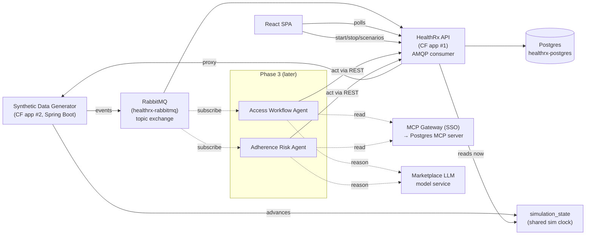

# Phase 2 Design — Event-Driven Backbone & Synthetic Data Generator

Status: **implemented & deployed** (2026-06-30) — backend event backbone, the generator app, and
the Simulation control panel are live on `healthrx` / `healthrx-generator` in the `healthrx` space.
This doc covers Phase 2 (the event backbone that makes HealthRx live) and the parts of Phase 3
(agents) it must not box us out of. See **As-built notes** at the end for deltas from the plan.

Related docs: [architecture](architecture.md) · [data-model](data-model.md) ·
[api-contracts](api-contracts.md) · [metric-definitions](metric-definitions.md) ·
[product-brief](product-brief.md) · [app-overview](app-overview.md)

## 1. Purpose & demo thesis

The customer-facing goal is to show **how easy it is to build and deploy agentic applications on
Tanzu Platform for Cloud Foundry**, exercising as many platform capabilities as possible
(marketplace services, an MCP gateway with SSO, and model/agent observability).

That goal is fundamentally the **Phase 3 agentic story**. **Phase 2 is the enabler:** it makes
HealthRx a living, event-driven system so that:

- the queue and dashboard move on their own during a talk track (ambient liveness), and
- there is a real event stream and set of write paths for **Phase 3 agents to sense and act on**.

> One-line framing: *Phase 2 builds the nervous system; Phase 3 adds the brain.*

## 2. Scope & sequencing

**Build now (Phase 2):**
- RabbitMQ-based event backbone (bind the preprovisioned `healthrx-rabbitmq`).
- An idempotent event **consumer** in the existing HealthRx API.
- Four small **app write-path additions** so every event has a landing spot (§7).
- A **shared simulated clock** so the world ages on fast-forward (§6).
- A separate **synthetic data generator** CF app: ambient trickle + presenter-triggered scenarios.
- Live UI refresh (polling) + a small **Simulation control panel**.

**Design now, build next (Phase 3):**
- Two **Spring AI agent** apps (Access Workflow Agent, Adherence Risk Agent).
- Marketplace **LLM model service** + **MCP gateway** (SSO) fronting the **Postgres MCP server**.
- Model/agent **observability** (token usage, latency, MCP tool-call logs) — surfaced by the
  platform, not built in the app.

**Non-goals (Phase 2):** the agents themselves; embeddings/RAG (no compelling use case — see §11);
production auth; real external integrations.

## 3. Architecture



All apps are separate Cloud Foundry apps bound to marketplace services — this multiplicity is part
of the platform story, not accidental.

## 4. Event catalog

The 15-value `WorkflowEventType` vocabulary already exists (see
[data-model](data-model.md#phase-2-event-alignment)). Each event maps to a HealthRx write path:

| Event | Ambient trigger | Write path | Moves / state | Build? |
| --- | --- | --- | --- | --- |
| `ReferralCreated` | New referral arrives | **NEW** create-referral | Queue grows; `referralsReceived` trend | ⚠️ |
| `BenefitsInvestigationStarted` | Advance | transition service ✅ | `benefits_investigation_started_at` | reuse |
| `PriorAuthorizationSubmitted` | Advance | transition ✅ | `pa_submitted_at`; PA age | reuse |
| `PriorAuthorizationApproved` / `Denied` | Payer decision | transition ✅ | `pa_decided_at`; PA turnaround | reuse |
| `FinancialAssistanceFound` | Assistance secured | `/financials` ✅ | FA tile + count | reuse |
| `ReadyToFill` / `DeliveryScheduled` | Advance | transition ✅ | milestone timestamps | reuse |
| `TherapyActivated` | Goes active | transition + activation ✅ | time-to-therapy; active patients | reuse |
| `ReferralCancelled` | Drop-off | transition ✅ | `closed_at` | reuse |
| `PrescriptionFilled` | Refill dispensed | **NEW** fill write path | DISPENSED fill; rolls refill due; PDC | ⚠️ |
| `RefillDue` | Refill window opens | **NEW** task write path | `REFILL_FOLLOW_UP` task; medium risk | ⚠️ |
| `RefillMissed` | Patient lapses | **NEW** miss write path | fill MISSED; HIGH risk; adherence drop | ⚠️ |
| `PatientOutreachLogged` | Engagement | outreach insert ✅ | refill-risk outreach condition | reuse |
| `ClinicalInterventionCreated` | Pharmacist acts | intervention insert ✅ | resolves outreach risk | reuse |

**Reserved for Phase 3 (agents emit these — §10):** `AgentRecommendationCreated`,
`AgentRecommendationApplied`.

### Message contract

Topic exchange `healthrx.events`; routing key `healthrx.event.<EventType>`. The API binds a durable
queue with `healthrx.event.#`; Phase 3 agents bind narrower keys (e.g.
`healthrx.event.RefillMissed`). JSON envelope:

```json
{
  "eventId": "f1e2…",            // idempotency key (uuid)
  "eventType": "RefillMissed",   // WorkflowEventType wireName
  "occurredAt": "2026-07-14T15:00:00Z", // simulated-clock instant
  "source": "generator",         // "generator" | "agent:<name>" | "presenter"
  "payload": { "referralId": "…", "patientId": "…", "therapyId": "…", "fillId": "…" }
}
```

Examples:
- `ReferralCreated` payload: `patientId` (existing or to-create patient stub), `clinicId`,
  `medicationId`, `payerId`, `ownerId`, `priority`, `paRequired`.
- `PrescriptionFilled` payload: `therapyId`, `patientId`, `daysSupply`, `dispensedAt`.
- `RefillMissed` payload: `therapyId`, `patientId`, `fillId` (the expected fill that lapsed).

Payload fields use the same names/UUIDs as the data model so the consumer maps straight onto
existing services.

## 5. Generator design

A new Spring Boot CF app. Two modes, both on by default:

- **Ambient trickle** — a few events/minute across three flows:
  1. **Access intake:** emit `ReferralCreated`, then walk a subset of referrals through the access
     milestones over simulated time; a few `ReferralCancelled`.
  2. **Therapy & refills:** for active therapies, periodic `PrescriptionFilled`; occasionally
     `RefillDue` → either filled or `RefillMissed`.
  3. **Engagement:** `PatientOutreachLogged` / `ClinicalInterventionCreated` around at-risk patients.
- **Presenter-triggered scenarios** — curated bursts via the generator's control API, e.g.
  *New high-copay oncology referral*, *Advance referral X one stage*, *Send patient X at-risk*
  (`RefillMissed` + unsuccessful outreach), *Resolve risk* (`REACHED` outreach / intervention).

**Control surface:** the generator exposes a small REST API (`/sim/start`, `/sim/stop`,
`/sim/speed`, `/sim/scenario/{name}`). The HealthRx API proxies these so the UI's **Simulation
panel** only talks to HealthRx (one origin). Rate/speed and on/off are presenter-controllable.

The generator references real seeded entities (clinics, payers, medications, care team, patients)
so events are consistent; new referrals may reuse existing patients or create lightweight new ones
via `ReferralCreated`.

## 6. Time — shared simulated clock

Phase 1 pins "now" to a fixed instant for reproducibility. Phase 2 introduces a **shared simulated
clock** so the world ages (refills come due, PA ages) on fast-forward — the payoff of an ambient
generator.

- A single-row **`simulation_state`** table holds `current_instant` (+ `enabled`, `speed`).
- The **generator owns** advancing it (e.g. +1 simulated hour per real second, configurable via
  `/sim/speed`) and stamps every event's `occurredAt` from it.
- The **API's clock** (`AppTime`) reads `current_instant` when simulation is `enabled`, else falls
  back to the Phase-1 pinned instant (or `system`). This cleanly extends the existing
  `healthrx.clock` config rather than replacing it.
- Start anchor = the Phase-1 pin (`2026-06-29`), so the seeded dashboard is unchanged at t0 and
  evolves from there.

Both apps already bind Postgres, so the DB row is a simple shared source of truth (API may short-
cache it). No extra coordination channel needed.

## 7. App modifications (small, well-scoped)

1. **Create-referral path** (`ReferralCreated`) — Phase 1 had none. Creates a referral in
   `ELIGIBILITY_IDENTIFIED` + initial history row (+ optional new patient stub).
2. **Fills writable** (`PrescriptionFilled`) — create a DISPENSED fill, increment `fill_number`,
   roll `therapies.current_refill_due_date`.
3. **Tasks + miss handling** (`RefillDue` → create `REFILL_FOLLOW_UP` task; `RefillMissed` → mark a
   fill MISSED). Fills/tasks were read-only seed data in Phase 1.
4. **Consumer infrastructure** — `spring-boot-starter-amqp`, queue listener, **idempotency** via a
   `processed_events` table (`event_id` PK; check-before-apply, insert-on-success), **dead-letter
   queue** for unprocessable/non-applicable events, and an `eventType → service` dispatcher. The
   transition service is already centralized, so most events are pure wiring.

Supporting bits: seed a **`system`** care-team member (and later an **`agent`** member) so
event-applied writes have an actor and the UI/observability can distinguish human vs. synthetic vs.
agent. `referral_status_history.changed_by_id` is already nullable for system transitions; inserts
(notes/outreach/interventions) need a non-null actor → use the `system` member.

**Robustness:** at-least-once delivery means the consumer must be **idempotent** and **tolerant of
out-of-order / non-applicable events** (e.g. an event that doesn't match current state is logged
and dead-lettered, never crashes). This robustness is itself part of the platform story.

## 8. Live UI

- **MVP:** TanStack Query refetch intervals (~5–10s) on the queue and dashboard so changes appear
  without manual refresh. Trivial, no new infra.
- **Stretch:** server-sent events (SSE) from the API ("something changed → invalidate") for an
  instant "watch it move" feel.
- **New:** a **Simulation control panel** (start/stop, speed, scenario buttons) — likely a small
  admin route in the SPA calling the HealthRx proxy to the generator.

## 9. Consumer flow (per event)

```
receive ─▶ parse envelope ─▶ seen(eventId)? ──yes──▶ ack (no-op)
                                   │no
                                   ▼
                        dispatch by eventType ─▶ centralized service (transition / fill / task / insert)
                                   │success                         │error (non-applicable / invalid)
                                   ▼                                ▼
                     record processed_events, ack            dead-letter + structured log
```

## 10. Event vocabulary extension (agents emit their own events)

Reserve in the vocabulary now; emitted in Phase 3:
- **`AgentRecommendationCreated`** — an agent produced a recommendation (case summary, next-action,
  draft outreach) for a referral/patient. `source = "agent:<name>"`.
- **`AgentRecommendationApplied`** — a human accepted/acted on a recommendation.

These surface as a new patient-timeline type (e.g. `AGENT`) and feed observability, giving a visible
"the agent did this / a human accepted it" trail. The timeline type system is already open-ended, so
this is additive.

## 11. Phase 3 preview (so Phase 2 fits it)

- **Agents** (Spring Boot + **Spring AI**, separate CF apps — matches the Shields Spring audience and
  the "easy to build" story):
  - **Access Workflow Agent** — watches `ReferralCreated`/stuck referrals → summarizes the case +
    recommends the next access action / drafts a note.
  - **Adherence Risk Agent** — watches `RefillMissed`/risk → drafts outreach, recommends an
    intervention.
- **Sense:** subscribe to RabbitMQ. **Reason:** marketplace **LLM model service** binding (token
  usage/latency → platform dashboards). **Read context:** **MCP gateway** (SSO) → **Postgres MCP
  server** (referral status/history), every tool call attributed/logged. **Act:** write back to
  HealthRx (and emit `AgentRecommendation*`).
- **Observability (platform, not app):** model token usage/latency/rate-limits + MCP tool-call logs
  with SSO identity, shown in platform dashboards as the agents work.

**Marketplace provisioning checklist:** Postgres ✅ · RabbitMQ ✅ · **+ LLM model service** ·
**+ MCP gateway** (register the Postgres MCP server, enable SSO). Embeddings: **not needed** (no RAG).

### Platform capabilities exercised (the "use as many features as possible" map)

| Capability | Used for | Phase |
| --- | --- | --- |
| Marketplace: Postgres | app DB + simulated-clock state | 1 ✅ |
| Marketplace: RabbitMQ | event transport | 2 |
| Marketplace: LLM model service | agent reasoning; token-usage metrics | 3 |
| Marketplace: MCP gateway (+ SSO) | front MCP servers; attribute/track tool calls | 3 |
| Postgres MCP server (behind gateway) | agent reads referral status/history | 3 |
| Model + agent observability | token usage, latency, rate limits, tool-call logs | 3 |
| Multiple CF apps + service bindings | API, generator, 2 agents as separate apps | 2 / 3 |

## 12. Open decisions (deferred, with leanings)

> **Both resolved 2026-07-01 — see [phase-3-design](phase-3-design.md).** Agent writes go through
> a **HealthRx-embedded MCP server** (Spring AI `@Tool`) behind the gateway, not plain REST; and
> the **drug/disease knowledge MCP** is confirmed as a second (standalone) MCP server, built in
> Phase 3b. Original framing kept below for the record.

- **How agents act (REST vs. MCP-wrapped writes).** Reads via the Postgres MCP server are settled.
  For writes, leaning **agents call the HealthRx REST API** (it already validates transitions);
  alternative is exposing HealthRx actions as their own MCP server so writes are *also* SSO-tracked
  through the gateway (stronger "everything via MCP" story, more to build). **Does not affect Phase
  2.** Decide during Phase 3.
- **Second MCP server.** Anchor is the Postgres MCP server. A read-only **drug/disease knowledge
  MCP** is the most plausible second one (grounds recommendations without RAG). Decide in Phase 3.

## 13. Phase 2 build milestones

1. **Messaging foundation** — bind RabbitMQ; topic exchange/queue/DLQ; envelope; consumer skeleton;
   `processed_events`; idempotency; wire the *reuse* events to existing services.
2. **App write-path gaps** — create-referral; fills writable; tasks; miss handling; `system` actor;
   update the contract docs in the same change.
3. **Simulated clock** — `simulation_state`; `AppTime` reads it; config toggle; default = Phase-1 pin.
4. **Generator app** — new CF app; ambient trickle (3 flows); event production on the sim clock.
5. **Presenter scenarios + control panel + live UI** — scenario triggers; HealthRx proxy; Simulation
   panel; polling refresh.
6. **Observability & Phase-3 readiness** — structured event logs/metrics; reserve agent events;
   confirm an agent app can bind RabbitMQ and subscribe.

## 14. Testing strategy (Phase 2)

- Consumer **idempotency** (duplicate `eventId` applied once) and **non-applicable event** handling
  (dead-letter, no crash) — unit + integration.
- Event-handler unit tests per new write path (create-referral, fill, refill due/missed).
- **Testcontainers RabbitMQ** integration: publish → consume → DB state asserted.
- Generator scenario tests (a triggered scenario emits the expected event sequence).
- Existing Phase-1 suite stays green (single-jar build, migrations, metrics, transitions).

## 15. Risks & considerations

- **Clock coupling** — if simulation is off, the world is static (by design); ensure the default/
  fallback is the Phase-1 pin so the seeded demo is unchanged.
- **Event storms** — cap ambient rate; the Simulation panel can pause/slow for a clean talk track.
- **Determinism** — ambient flow is inherently non-deterministic; presenter scenarios should be
  deterministic and repeatable for reliable demoing.
- **Generator ↔ API coupling** — proxying control through the API keeps one origin for the UI but
  couples them; acceptable for a demo (could be a tiny generator UI instead).

## As-built notes (deltas from the plan)

- **Simulated clock semantics:** the API reads `simulation_state.current_instant` as "now" **always**
  (not only when enabled). `enabled` governs only whether the generator advances the clock, so
  pausing **freezes** simulated time instead of reverting to the pin — keeping the generator and API
  on the same clock. `current_instant` is seeded to the Phase-1 anchor (2026-06-29).
- **Therapy auto-creation:** transitioning a referral to `ACTIVE_THERAPY` with no linked therapy
  auto-creates and links one (chosen over rejecting), so the generator can drive full intake→active
  journeys.
- **FinancialAssistanceFound** is best-effort: it transitions into `FINANCIAL_ASSISTANCE_REVIEW`
  only when legal, and always records the amounts (so financials aren't lost when past review).
- **No-op transitions** (target == current status) are idempotent no-ops, so redelivered/out-of-order
  milestone events don't dead-letter.
- **Idempotency** is an atomic claim (`insert … on conflict do nothing`) inside the apply
  transaction, not a separate pre-check, so duplicates can't double-apply.
- **Refill-risk resolution** accepts a REACHED outreach / adherence intervention that is *at or
  after* (not strictly after) the last unsuccessful outreach — so `resolve-risk` works even when the
  clock is paused and events share an instant.
- **Deploy:** two CF apps in one manifest (`healthrx`, `healthrx-generator`), both bound to
  `healthrx-postgres` + `healthrx-rabbitmq`; java-cfenv maps both. HTTP health-check targets
  `/actuator/health/liveness` so a broker blip doesn't crash-loop the API. Buildpack
  `java_buildpack_offline`.
- **Presenter scenarios:** `new-referral`, `advance-referral`, `send-at-risk`, `resolve-risk`. The
  at-risk/resolve pair targets the seeded MS patient (PX-2044) for the Act-2 demo.
- **One-click reset** (`POST /api/admin/reset`, "Reset demo" button): pauses the simulation,
  TRUNCATEs all data, re-runs the V2 seed script, restores the System/Care-Agent actors, and resets
  the clock to the anchor — verified live to restore the exact seeded baseline.

**Verified live:** ambient stream (all event types, 0 dead-letters), referral growth, clock
advance, and the send-at-risk → HIGH → resolve-risk → LOW arc.
