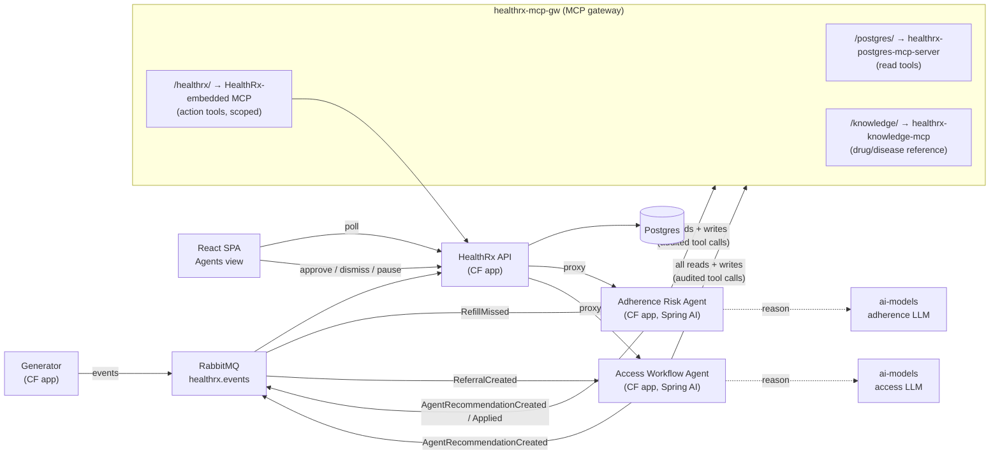

# Phase 3 Design — AI Agents, MCP Gateway & Model Observability

Status: **Phase 3 implemented & deployed (3a + 3b, 2026-07-02)** — both agents, the embedded MCP
action server, the knowledge MCP server, gateway registration, and the Agents view are live and
verified on CF (see **As-built notes** at the end). SSO remains staged (§4). A third agent is
possible later; nothing here precludes it.

Related docs: [architecture](architecture.md) · [data-model](data-model.md) ·
[api-contracts](api-contracts.md) · [metric-definitions](metric-definitions.md) ·
[phase-2-design](phase-2-design.md) · [postgres-mcp-tools](postgres-mcp-tools.md)

## 1. Purpose & demo thesis

Phase 3 *is* the demo's north star: **show how easy it is to build and deploy agentic applications
on Tanzu Platform for Cloud Foundry**, exercising as many platform capabilities as possible. Phase 2
built the nervous system (events, write paths, simulated time); Phase 3 adds the brain:

- **Marketplace AI models** — each agent binds its own `ai-models` service instance, so the
  platform's token-usage/latency metrics attribute **per agent**.
- **MCP gateway** — all agent data access flows through `healthrx-mcp-gw`; every tool call is
  audit-logged by the platform (`mcp.audit` JSON logs: tool name, arguments, caller identity).
- **Model & agent observability** — platform-surfaced (Tanzu Hub / dashboards / `cf logs`), not
  app-built. The app surfaces *decisions*; the platform surfaces *metrics*.

> One-line framing: *agents sense through RabbitMQ, think through marketplace LLMs, read and act
> through the MCP gateway — and everything they do is attributable.*

## 2. The two agents & the autonomy model

The governing principle is **autonomy calibrated to risk** — administrative work may be automated;
clinical decisions always get a human.

| | Adherence Risk Agent (3a) | Access Workflow Agent (3b) |
| --- | --- | --- |
| Territory | Clinical (outreach, interventions, fills) | Administrative (work routing) |
| Autonomy | **Recommend-only** — a human approves every action | **Autonomous, low-stakes** — creates tasks without approval |
| Senses | `healthrx.event.RefillMissed` | `healthrx.event.ReferralCreated` + periodic stuck-referral scan |
| Acts | On approval: log `REACHED` outreach, create intervention, **record the refill fill** | Auto-creates an `ACCESS_FOLLOW_UP` task assigned to the referral owner |
| Emits | `AgentRecommendationCreated` + `AgentRecommendationApplied` | `AgentRecommendationCreated` only (born `AUTO_APPLIED`) |
| Demo beat | The Act-2 arc, agent-powered: Marlowe HIGH → agent drafts the plan → pharmacist approves → LOW | Stuck PA → task with case summary + next action appears on the owner's queue |

**Why this split works:** the Adherence agent's outputs mutate refill-risk metrics and represent
clinical acts, so a human approves each one (the approval *is* the demo's human-in-the-loop moment).
The Access agent's only write is **creating a task** — it changes no patient or referral state; it
routes work to a human. Its recommendation *is* its action, so it needs no approval UI.

**Why the fill tool is in the Adherence catalog:** per
[metric-definitions](metric-definitions.md) §Refill Risk, a `REACHED` outreach / adherence
intervention resolves only the *outreach-driven* high-risk condition — it explicitly does **not**
override the refill-overdue condition, which only a dispensed fill (or time) clears. After
`send-at-risk`, Marlowe is HIGH on *both* conditions, so the approved plan must include recording
the refill (narratively: the pharmacist reached the patient with the agent's script and the refill
was dispensed) — exactly what the Phase 2 `resolve-risk` scenario proved out.

### Guardrails (both agents; enforced, not prompt-hoped)

1. **Server-side tool scoping** — the HealthRx MCP server **authorizes every `tools/call` against
   the caller identity's per-agent allow-list** (§5.2) and rejects out-of-scope calls. (The tool
   catalog itself is one static list — the Spring AI starter registers a single provider — so
   enforcement happens at call time, per identity, inside the server; never by prompt.)
2. **Dedup & cooldown** — the primary guard is **state-based**: at most one **live** open
   recommendation per subject (patient for Adherence, referral for Access), checked against
   `agent_recommendations` via Postgres MCP, with an in-memory in-flight set covering the async
   window before the row lands (§6). *Live* means `APPLYING`, or a `PENDING` row that is still
   **fresh** — a `PENDING` row is *stale* once the risk inputs it addressed have changed (a later
   dispensed fill, `REACHED` outreach, or qualifying intervention after its `created_at`); on a new
   distinct trigger the agent proceeds past a stale row and the resulting `Created` supersedes it
   (§6). Time-based cooldowns and the Access rate cap are measured on the **simulated clock**;
   **paused-clock rule:** while the sim is paused, time-based guards are bypassed (the presenter is
   in control; state-based guards still apply), so the scripted beat can repeat in one pass.
3. **Per-agent kill switch — durable.** Pause state lives in a DB `agent_control` row (seeded
   `paused = true` by V4 — agents ship paused; API writes are upserts) and is checked by the agent
   per trigger via Postgres MCP, so a restart cannot silently un-pause an agent.
4. **Nothing invisible** — every recommendation (auto-applied or not) writes an
   `agent_recommendations` row, emits `AgentRecommendation*` events, surfaces on the patient
   timeline when applied, and appears in the gateway audit logs. Crash windows self-heal (§6).
5. **Demo-reset safe** — reset truncates `agent_recommendations` + `agent_tool_calls`, restores
   the agent actors, and **pauses both agents** (via `agent_control`). Known caveat: an agent event
   already queued before reset can still apply afterward (the fixed-UUID seed means its references
   resolve). Recovery: a stray `PENDING` row is dismissed; a stray `AUTO_APPLIED` row is visible in
   the feed and its task is completed/cancelled like any task — or simply reset again. Same class
   of caveat Phase 2 accepted for in-flight generator events.

## 3. Architecture

Agents have **no direct database binding** — every read and every write goes through the gateway as
an audited MCP tool call. Their only other bindings are RabbitMQ (sense/emit) and their own LLM
service (reason).

## 4. Platform inventory, provisioning & wiring

Verified on the techbrese foundation's `healthrx` space (2026-07-01):

| Service / app | Offering / plan | Status |
| --- | --- | --- |
| `healthrx-adherence-risk-agent-llm` | `ai-models` / `gpt-5.4` | provisioned, unbound; **tool calling confirmed** |
| `healthrx-access-workflow-agent-llm` | `ai-models` / `gpt-5.4` | provisioned, unbound (renamed 2026-07-01 to fix a "worklfow" typo) |
| `healthrx-mcp-gw` | `mcp-gateway` / `gateway` | provisioned, nothing registered |
| `healthrx-postgres-mcp-server` | CF app, internal route `healthrx-postgres-mcp.apps.internal`, bound to `healthrx-postgres` | pushed; **not yet registered with the gateway** |

**Gateway registration** (from the Tanzu AI Services 10.4 reference): an on-platform MCP server is
registered by **binding the server app to the gateway instance** —
`cf bind-service <server-app> healthrx-mcp-gw [-c '{"auth": …}'] --wait`. Each registered server is
exposed under its own `/<name>/` path prefix on the gateway route. Off-platform servers can be added
via the gateway's `mcp-servers` service parameter (not needed here).

**Deploy & wiring (extends the Phase 2 manifest pattern).** Binding an app to `healthrx-mcp-gw`
*registers it as an MCP server*, so agents must **not** bind the gateway to consume it — they reach
it by URL. The agent apps join `manifest.yml` with their own routes (the API proxies control calls
to them) and env vars: the **gateway base URL** (+ per-server path prefixes) and the per-agent
`X-Agent-Id` shared secret; the API gains env vars for the two agent control-API base URLs
(`ADHERENCE_AGENT_URL`, `ACCESS_AGENT_URL`) — all parameterized in `cf-vars/techbrese.yml`.
Discovering the gateway's client-facing URL/credentials is spike §11.2.

**SSO is staged, not blocking.** The marketplace SSO/OIDC service exists but is unverified on this
foundation. Plan: register all MCP servers **unauthenticated (or `forward_token`) first**; when the
SSO service is confirmed working, create the OIDC service instance (or a UPSI carrying IdP
credentials), rebind with `{"auth": {"service-instance": {"type": "OIDC", "name": …}}}`, and give
**each agent its own identity** so `enduser.id` in the audit logs attributes tool calls per agent.
Interim attribution: each agent sends a distinctive `User-Agent` (captured in the audit log's
`user_agent.original`) and an `X-Agent-Id` header carrying a per-agent shared secret (env-configured)
that the HealthRx MCP server uses for tool scoping — replaced by token claims when SSO lands.

## 5. MCP topology & tool catalog

### 5.1 Postgres MCP server (reads) — exists

Generic read-only SQL tools (see [postgres-mcp-tools](postgres-mcp-tools.md)): `listSchemas`,
`listTables`, `executeQuery` (prefix-validated read-only), `select`.

Agents query two classes of tables through it:
- **LLM context tables** (embedded in the system-prompt schema orientation so the model writes
  purposeful SQL): `referrals`, `referral_status_history`, `therapies`, `fills`,
  `outreach_events`, `clinical_interventions`, `tasks`, `patients`.
- **Deterministic guard reads** (issued by agent *code*, not the model): `agent_recommendations`
  (dedup/staleness), `agent_control` (pause flag), `simulation_state` (sim clock),
  `processed_events` (wait-for-trigger + emit-repair checks), `agent_tool_calls` (crash-recovery
  checks).

Known caveats (acceptable for the demo, recorded honestly): read-only enforcement is prefix-based
(not a SQL parser); the JDBC connection is not marked read-only; no statement timeout or row cap;
it holds the app-level (writable) DB credentials. Mitigations: agents are prompted to always
`LIMIT`; hardening option if ever needed is a dedicated read-only Postgres role.

### 5.2 HealthRx-embedded MCP server (actions) — build in 3a

Spring AI `@Tool` methods in the existing API app, exposed via the Spring AI MCP server starter at
`/mcp` on the `healthrx` app, registered behind the gateway. Tools delegate to the **existing
centralized services** (the same ones the event consumer uses), so all domain validation applies.
The `/mcp` endpoint sits on the app's public route, so until SSO lands it **requires the per-agent
`X-Agent-Id` shared secret** and rejects calls without it — the gateway (which forwards headers,
spike §11.4) is the only practical path in.

| Tool | Args (summary) | Backing service | Exposed to |
| --- | --- | --- | --- |
| `log_outreach` | **recommendationId**, patientId, referralId?, channel, outcome, notes | outreach insert | Adherence |
| `create_intervention` | **recommendationId**, patientId, referralId?, interventionType, summary | intervention insert | Adherence |
| `record_prescription_fill` | **recommendationId**, therapyId, daysSupply?, dispensedAt? | Phase 2 fill write path (rolls `current_refill_due_date`) | Adherence |
| `create_task` | **recommendationId**, patientId, referralId, type=`ACCESS_FOLLOW_UP`, priority, title, description, dueAt? → **returns taskId** | task write path | Access |

**Idempotency (what makes the §6 retry contract true):** every action tool requires the caller's
`recommendationId`. The embedded server records each successful invocation in the
`agent_tool_calls` ledger — **unique on `(recommendation_id, tool_name)`, written in the same
transaction as the domain insert** — and a replay returns the stored prior result instead of
re-inserting. (Each recommendation invokes each tool at most once, so the composite key suffices.)
This is the MCP-path analogue of the consumer's `processed_events` dedup, which HTTP tool calls
bypass.

Deliberately small: no status transitions, no financials — those stay human (or third-agent
material later).

**Attribution:** `outreach_events` / `clinical_interventions` rows written by these tools carry the
**agent's care-team actor** as `owner_id`, so the UI shows agent-authored clinical records
distinctly. Tasks are different: `tasks.owner_id` is the *assignee* (the referral owner who must do
the work) and the table has no author column — agent authorship is carried by the linked
`agent_recommendations` row (`task_id` column, from `create_task`'s returned id) and a `[Agent]`
title prefix.

### 5.3 Knowledge MCP server (reference reads) — build in 3b

A standalone Spring Boot CF app under `mcp-servers/knowledge/`, registered behind the gateway.
Read-only curated reference tools grounding the agents' drafts — e.g.
`get_medication_guidance(medicationName)` (adherence importance, common side effects, missed-dose
guidance) and `get_condition_guidance(diseaseState)`. Content is authored at build time for the
seeded medications/disease states only — a **curated dataset, not RAG** (per the Phase 2 decision:
no embeddings). Primary consumer: the Adherence agent's outreach scripts; the Access agent may use
it for case summaries.

## 6. Agent lifecycle & eventing

Agents reuse the Phase 2 messaging contract end-to-end.

**Sense** — each agent binds its own durable queue with a narrow routing key
(`healthrx.event.RefillMissed` / `healthrx.event.ReferralCreated`) on the existing
`healthrx.events` topic exchange.

**Clocks** — event `occurredAt` remains a **simulated-clock instant** (Phase 2 contract): agents
read `simulation_state.current_instant` via Postgres MCP at emit time (itself an audited call).
Row timestamps (`created_at`, `decided_at`) are stamped by the API via `AppTime` (already
sim-aware) — except `applying_at`, which is wall-clock because it measures a real-time proxy
timeout while the sim is typically paused.

**Deterministic identity (idempotency spine).** Every agent run has a stable
`recommendationId`:
- **Event-triggered runs**: UUIDv5 over `(agentName, trigger eventId)`.
- **Scan-detected runs** (Access stuck-referral scan — no broker event): UUIDv5 over
  `(agentName, referralId, stuckRule, statusEnteredAt, priorDecidedCount)` — where
  `statusEnteredAt` is the sim-timestamp the referral entered its current status (defines the
  stuck episode) and `priorDecidedCount` is the count of this referral's already-decided
  (`DISMISSED`/`SUPERSEDED`/completed) agent recommendations for that rule, read via Postgres MCP.
  Replays and post-crash re-runs of the *same* episode reuse the id; a genuinely new
  recommendation after a dismissal derives a new one.
- Event ids follow: `Created` eventId = UUIDv5(`recommendationId`, "created"); `Applied` eventId =
  UUIDv5(`recommendationId`, "applied"). Redelivered or re-emitted events dedupe in
  `processed_events`; replayed tool calls dedupe in `agent_tool_calls` (§5.2). The
  `trigger_event_id` column stores the broker eventId for event runs and the synthesized episode
  id for scan runs.

**Recommendation lifecycle rides the reserved events** (already in `WorkflowEventType` and the V3
DB constraint):

- Agent finishes reasoning → emits **`AgentRecommendationCreated`** (`source = "agent:<name>"`,
  payload = the full recommendation record incl. trace, and `taskId` for Access). The **existing
  idempotent consumer** writes the `agent_recommendations` row (`PENDING` for Adherence;
  `AUTO_APPLIED` for Access, whose task was already created via MCP in the same run). If the
  subject still has a stale `PENDING` row (guardrail 2), the consumer marks it `SUPERSEDED` in the
  same transaction.
- Human approves (Adherence) → agent executes the actions via HealthRx MCP tools → emits
  **`AgentRecommendationApplied`** for the event stream/audit trail. Status transitions do **not**
  depend on that event arriving (below), but its consumer handler is a **state repair, not a pure
  no-op**: `PENDING`/`APPLYING` → `APPLIED` (stamping `decided_at` if unset); zero rows matched →
  no-op. This heals the API-restarted-mid-approve and timeout-revert races.

**Approval routing (locked decision — "option B"), hardened:**

1. SPA calls `POST /api/agents/recommendations/{id}/approve` with the acting user's id (the
   "Acting as" selector, per the API's common rules) → recorded as `decided_by_id`.
2. The API **atomically gates** the row `PENDING → APPLYING`, stamping `applying_at` (wall-clock)
   (`UPDATE … WHERE status='PENDING'`; anything else → `409`), then proxies to the owning agent's
   control API (`/agent/recommendations/{id}/apply`). Double-clicks and races cannot double-apply.
3. The agent performs the MCP tool calls — **exactly-once per `(recommendationId, tool)` via the
   `agent_tool_calls` ledger** — and emits `AgentRecommendationApplied`.
4. On a successful proxy response the API marks the row `APPLIED` **synchronously** — the UI never
   depends on event round-trip timing.
5. On proxy failure/timeout the row reverts to `PENDING` (safe to retry: replayed tools return
   their ledgered results) and the endpoint returns `502` with an error body — the same contract as
   the generator proxy ([api-contracts](api-contracts.md) §Simulation Control).
6. **Crash recovery — `APPLYING` is always transient.** If the API dies between the gate and the
   response handling, no in-process revert runs. Two backstops: (a) the consumer's `Applied`
   repair handler (above) covers the agent-completed case; (b) a row still `APPLYING` with
   `applying_at` older than 2× the proxy timeout is **lazily re-armed to `PENDING`** by the
   recommendations read path, so approve becomes available again — safe, again, because the tools
   are ledger-idempotent.

Dismiss is API-local (no agent involvement; `PENDING → DISMISSED`, records `decided_by_id`).

**Timeline:** the patient timeline is *derived*, not written — it gains an `AGENT` item type
sourced from `agent_recommendations` rows with status `APPLIED` / `AUTO_APPLIED` (title = summary,
actor = the agent's care-team member, metadata = `decidedBy` when present).

### Adherence Risk Agent — run loop (3a)

1. `RefillMissed` arrives (ambient or the `send-at-risk` scenario).
2. Guards (all via Postgres MCP): `agent_control.paused`? open `APPLYING` recommendation or
   in-flight run for this patient? open **fresh** `PENDING` (guardrail 2 staleness rules)?
   sim-clock cooldown (bypassed while paused)? → skip. A stale `PENDING` does *not* block; the new
   run's `Created` will supersede it.
3. **Wait for the trigger to be applied**: poll `processed_events` for the trigger `eventId`
   (short timeout) so context reads see the missed fill and rolled due date — the API consumer and
   the agent receive the same event concurrently.
4. Context via Postgres MCP: therapy + fill history, outreach history (recent unsuccessful
   attempts), referral/patient facts, current risk inputs. (3b adds knowledge MCP for drug
   guidance.)
5. LLM (its `ai-models` binding) produces a structured recommendation: risk explanation, **draft
   outreach script** (channel + message), **proposed intervention** (type + rationale), **refill
   plan** (record the fill on approval).
6. Emit `AgentRecommendationCreated`; row appears `PENDING` in the Agents view.
7. On approve: `log_outreach` (outcome `REACHED`) + `create_intervention`
   (`ADHERENCE_COUNSELING`) + `record_prescription_fill` via the gateway → emit
   `AgentRecommendationApplied` → **all three** high-risk inputs clear → HIGH → LOW (same
   mechanics the `resolve-risk` scenario proved).

Attribution: outreach/intervention rows carry the agent's care-team actor; the recommendation
records `decided_by` = the approving human; the timeline shows both ("recommended by agent,
approved by X").

### Access Workflow Agent — run loop (3b)

1. Trigger: `ReferralCreated` (triage new case; same wait-for-`processed_events` step before
   context reads), plus a scan every ~60 real seconds that reads the sim clock and referral ages
   **via Postgres MCP** (cheap SQL, no LLM) for stuck referrals — defaults: PA pending > 5
   sim-days, any pre-active status unchanged > 10 sim-days (configurable).
   **Baseline suppression:** on startup and after every reset, the first scan records
   currently-stuck referrals as the baseline (no recommendations) — only referrals that *become*
   stuck afterwards trigger, and each scan pass caps new recommendations (default 3). Without
   this, the seeded data (~50 pre-active referrals older than the thresholds at the anchor) would
   flood the feed with LLM calls on resume.
2. Guards: paused (`agent_control`)? rate cap this sim-hour (bypassed while paused)? existing open
   `[Agent]` task for this referral **whose run completed** (its `Created` eventId is in
   `processed_events`)? → skip. **Emit-repair:** if the task exists but the event never landed
   (crash between `create_task` and emit), re-emit `Created` from the task's persisted
   payload/ledger — no LLM re-run — so the recommendation row appears and "Nothing invisible"
   holds.
3. Context via Postgres MCP; LLM produces a case summary + recommended next access action.
4. `create_task` via the gateway (type `ACCESS_FOLLOW_UP`, assignee = referral owner, `[Agent]`
   title, description = summary + recommendation; returns `taskId`) → emit
   `AgentRecommendationCreated` (`AUTO_APPLIED`, payload includes `taskId`). Emit failures retry
   with the same deterministic eventId; the ledger makes `create_task` replay-safe.
5. The task appears in the owner's queue/workbench like any human-created task; the Agents feed
   shows the auto-action with its trace.

## 7. Data model additions (V4 migration)

- **`agent_recommendations`**: `id` uuid PK · `agent_name` text · `patient_id` uuid FK **required**
  (both agents always know it; referrals carry a required patient) · `referral_id` / `therapy_id` /
  `task_id` uuid FKs nullable (`task_id` links Access recommendations to their task) ·
  `trigger_event_id` uuid (broker eventId, or the synthesized scan-episode id) ·
  `trigger_event_type` text · `status` text CHECK (`PENDING`, `APPLYING`, `APPLIED`,
  `AUTO_APPLIED`, `DISMISSED`, `SUPERSEDED`) · `summary` text · `recommendation` jsonb (structured
  proposed actions) · `trace` jsonb (ordered steps: what it saw / queried / concluded) ·
  `created_at` · `applying_at` timestamptz nullable (wall-clock, §6 step 6) · `decided_at` ·
  `decided_by_id` FK nullable.
- **`agent_tool_calls`** (the apply-path idempotency ledger, §5.2): `recommendation_id` uuid ·
  `tool_name` text · `result` jsonb · `created_at` — **PK `(recommendation_id, tool_name)`**,
  written in the same transaction as the domain insert. No FK to `agent_recommendations` (the
  Access agent's `create_task` legitimately precedes the row's consumer-side insert).
- **`agent_control`**: `agent_name` text PK · `paused` boolean · `updated_at`. **V4 seeds one row
  per agent with `paused = true`** (agents ship paused, matching the reset posture and §10 demo
  loop). API writes are **upserts** keyed on `agent_name`; agents treat a missing row as paused
  (fail-closed).
- **Task type** `ACCESS_FOLLOW_UP` added to the `task_type` CHECK (keeps agent tasks filterable).
- **Two named agent actors** in `care_team_members` with **fixed UUIDs** (seed convention;
  required by the reset restore): `…0003` *Adherence Risk Agent*, `…0004` *Access Workflow Agent*
  (role `AI Agent`). The generic Phase 2 *Care Agent* row (`…0002`) remains for compatibility.
  **Lookup change shipped with V4:** the owners lookup (feeding the Acting-as selector, owner
  filters, and task assignment) excludes roles `System` and `AI Agent`, so `decided_by_id` is
  always human and the selectors stay clean; agent actors still resolve by id for timeline/detail
  display. `ResetService` restores all non-human actors, truncates `agent_recommendations` +
  `agent_tool_calls`, and upserts both `agent_control` rows to paused.
- **Timeline type `AGENT`** — derived from `agent_recommendations` (§6), no new timeline storage.

## 8. API additions (all in the existing HealthRx API)

| Endpoint | Purpose |
| --- | --- |
| `GET /api/agents` | Both agents' status (up/paused, last activity, counts) — proxied/aggregated |
| `GET /api/agents/recommendations?status=&agent=&page=` | The Agents-view feed (rows incl. trace); read path lazily re-arms timed-out `APPLYING` rows (§6 step 6) |
| `POST /api/agents/recommendations/{id}/approve` | Body `{ decidedById }`. Atomic `PENDING→APPLYING` gate (else `409`) → proxy to owning agent → `APPLIED` on success; `502` + revert to `PENDING` when the agent is unreachable (generator-proxy contract) |
| `POST /api/agents/recommendations/{id}/dismiss` | Body `{ decidedById }`. API-local → `DISMISSED` |
| `POST /api/agents/{name}/pause` · `/resume` | Kill switch — upserts `agent_control` (durable) and notifies the agent |

Plus: patient timeline gains `AGENT` items; referral/patient detail responses gain a
`pendingAgentRecommendations` count for badges.

## 9. Agents view (SPA)

A new top-level route/nav link alongside Queue / Lifecycle / Dashboard:

- **Live activity feed** (poll ~3–5s, consistent with the app's polling pattern): newest first,
  each row = agent, subject (patient/referral link), summary, status chip
  (`PENDING` / `APPLYING` / `APPLIED` / `AUTO_APPLIED` / `DISMISSED` / `SUPERSEDED`).
- **Expandable trace** per recommendation: *what it saw → what it queried (tool calls) → what it
  concluded → what it proposes*. For `PENDING` rows: **Approve** / **Dismiss** buttons (approve
  sends the "Acting as" member id and shows the `APPLYING` state while the round-trip completes).
- **Per-agent header cards**: status, pause/resume toggle, counters (recommendations today,
  approval rate).
- **Badges** on referral/patient detail views when a pending recommendation exists.
- **Stretch (3b): live thought streaming** — SSE proxied through the API so a running
  recommendation's trace steps render as they happen. MVP renders the persisted trace on
  completion, which at 3–5s polling still reads as "live" on stage.

Division of labor stays clean: the app shows decisions and reasoning; **token usage, latency,
rate limits, and tool-call audit logs are shown on platform surfaces** (Tanzu Hub, dashboards,
`cf logs healthrx-mcp-gw`) — that contrast *is* the observability demo.

## 10. Demo interaction notes (presenter contract)

- The scripted 3a beat runs **with the ambient stream paused** (established Phase 2 practice —
  `send-at-risk` and the agent flow work deterministically on a frozen clock; time-based guards
  are bypassed while paused, so the beat is repeatable).
- **Bound the ambient segment before the 3a beat.** At the default speed (1 sim-day/sec) the clock
  races, and Marlowe's seeded fill coverage ends 2026-07-04: past sim ~2026-07-13 PDC dips to 89
  (approval yields HIGH→MEDIUM); past ~2026-07-22 PDC falls below 80 and the beat can't reach LOW.
  Keep the ambient segment short (≲10 real seconds) or reset before the beat.
- **Stage the agent resumes.** Resume the Access agent (3b) for the ambient segment; keep the
  Adherence agent paused until after the ambient pause — otherwise an ambient `RefillMissed` on
  Marlowe can pre-create the `PENDING` recommendation and make the scripted `send-at-risk` look
  like a no-op.
- The Phase 2 **`resolve-risk` scenario remains** as the non-agent fallback for the Act-2 arc.
  Don't run both for the same patient in one pass: if the ambient stream or a scenario resolves the
  risk while a recommendation is `PENDING`, the recommendation is stale — dismiss it, or let the
  next trigger supersede it (§6).
- Demo loop: Reset (agents come up paused) → \[3b: resume Access\] → ambient on (watch the queue
  move, Access tasks appear) → pause → resume Adherence → `send-at-risk` → agent recommendation
  appears (open the trace) → approve → Marlowe HIGH→LOW → show `mcp.audit` tool-call logs and
  per-agent token usage on platform surfaces → Reset.

## 11. Part 3a spikes (do these first — each de-risks a locked design choice)

1. **`ai-models` binding → Spring AI config**: inspect the binding credentials (endpoint/API-key
   shape), wire via java-cfenv. Tool calling on gpt-5.4: **confirmed** (owner-verified); smoke-test
   through Spring AI `ChatClient` anyway during wiring.
2. **Gateway registration end-to-end**: `cf bind-service healthrx-postgres-mcp-server
   healthrx-mcp-gw --wait`; discover the gateway's **client-facing URL + credential shape** (what
   agents put in env); confirm the gateway reaches the server's internal route; call `listTables`
   through the gateway from a local MCP client; confirm `mcp.audit` log lines appear (and enable
   payload logging for the demo).
3. **HealthRx-embedded MCP server registration**: confirm binding the `healthrx` app to the
   gateway exposes its `/mcp` endpoint correctly (path/transport config at bind time if needed).
4. **Identity at `@Tool` dispatch**: confirm the gateway forwards `X-Agent-Id` upstream **and**
   that the header is visible at tool-execution time in the Spring AI MCP server starter
   (request-scoped capture or MCP context). Fallback if either fails: per-agent bearer tokens in
   the MCP client config until SSO.

## 12. Build milestones

**Part 3a — Adherence Risk Agent + shared infrastructure**
1. Spikes (§11).
2. V4 migration (+ `agent_recommendations` / `agent_tool_calls` / `agent_control` repositories) +
   consumer handlers for the two agent events (`Created` incl. supersede, `Applied` as state
   repair) + lookup owners filter + reset integration.
3. HealthRx-embedded MCP server (`log_outreach`, `create_intervention`,
   `record_prescription_fill`, `create_task`) with the idempotency ledger, call-time identity
   scoping + shared-secret guard; register behind the gateway.
4. Adherence agent app: event listener, guards incl. staleness (§6), Postgres-MCP context reads,
   LLM recommendation, `AgentRecommendationCreated` emission, control API (apply/pause/status).
5. API additions (§8, incl. `APPLYING` lazy re-arm) + Agents view (§9, polling MVP).
6. E2E on CF: reset → resume agent → `send-at-risk` → recommendation → approve → Marlowe
   HIGH→LOW; audit logs + per-agent token metrics visible on platform surfaces.

**Part 3b — Access Workflow Agent + knowledge MCP**
1. Knowledge MCP server app; register behind gateway; wire into the Adherence agent's prompts too.
2. Access agent app: `ReferralCreated` listener + stuck-scan loop (baseline suppression, per-scan
   cap, scan-episode ids), `create_task` auto-action, emit-repair guard, rate cap, kill switch.
3. Agents view v2: `AUTO_APPLIED` presentation, per-agent cards polish; SSE thought-streaming
   (stretch).
4. E2E on CF: `new-referral` → triage task; age a PA past threshold → stuck-referral task.
5. SSO upgrade when the marketplace SSO service is confirmed: OIDC instance/UPSI, rebind all three
   MCP servers, per-agent identities, verify `enduser.id` attribution in audit logs.

## 13. Testing strategy

- **Unit**: guard logic (staleness rules, paused-clock bypass, baseline suppression); prompt
  assembly; recommendation JSON parsing; per-identity tool authorization; deterministic
  recommendation/eventId derivation (event and scan cases).
- **Integration (Testcontainers, following Phase 2 precedent)**:
  - consumer: duplicate `eventId` applied once; `Created` supersedes a stale `PENDING`; `Applied`
    repairs `PENDING`/`APPLYING` → `APPLIED` and no-ops otherwise;
  - approve flow (stubbed agent): atomic gate + `409` on double-approve; `502` + revert on
    unreachable agent; `APPLIED` + derived timeline entry on success; **idempotent re-apply after
    a partial apply** (ledger returns prior results, no duplicate domain rows); `APPLYING`
    lazy re-arm after timeout;
  - embedded MCP tools hit the real services against Postgres (incl. `record_prescription_fill`
    rolling the due date) and enforce the ledger + identity scoping;
  - reset truncates agent state, restores actors, pauses agents (upsert semantics).
- **Agent-loop test with a stubbed LLM** (deterministic canned completion): `RefillMissed` in →
  waits for `processed_events` → `AgentRecommendationCreated` out, correct guards.
- **Risk-resolution regression**: approving the canned recommendation flips the seeded at-risk
  therapy HIGH → LOW (mirrors `RefillRiskCalculatorTest` + the live `resolve-risk` verification).
- **Live verification on CF** per part (§12), including the platform-observability surfaces.

## 14. Open items

- **SSO/OIDC service** — unverified on the foundation; staged plan in §4 (does not block 3a).
- **Third agent** — deferred; candidate theme from the product brief: operational-risk escalation
  watching aggregate metrics. The recommendation/actor/timeline plumbing here is agent-count
  agnostic.
- **Knowledge MCP content scope** — which seeded medications/conditions get curated guidance
  (author during 3b).

## 15. As-built notes (Part 3a, 2026-07-02)

Deltas and discoveries from the build/deploy — the design above otherwise shipped as written:

- **Spring AI 1.1.8, not 2.x.** Spring AI 2.0 targets Boot 4; the repo is Boot 3.4.1, and 1.1.8
  provides everything used (ChatClient tool-calling loop, MCP client/server, streamable HTTP).
- **Gateway registration requires an internal route** on the registered app — the broker refuses
  the bind otherwise. `healthrx` now maps `healthrx-mcp.apps.internal` (manifest) alongside its
  public route; registration itself is the manifest's `healthrx-mcp-gw` service binding.
- **V5 grants:** each Postgres binding is its own role on this broker, so the Postgres MCP
  server's role couldn't read tables owned by the API's role. `V5__grant_mcp_reads.sql` grants
  SELECT (current + default future tables) — the MCP role is now read-only at the *role* level,
  strictly better than the tool-level prefix guard alone (§5.1 caveat).
- **Wire format quirks:** the `ai-models` endpoint rejects `max_tokens` (use
  `max_completion_tokens`; Spring AI 1.1 handles this) and gpt-5.x accepts only default
  temperature (pinned 1.0). The Postgres MCP server serializes `timestamptz` as **epoch millis**;
  the agent's guard/clock reads parse both epoch and ISO forms.
- **Tool-result normalization:** `agent_tool_calls.result` is jsonb, which normalizes formatting —
  the action service returns the ledgered form so replays are byte-identical to first execution.
- **Header identity verified end-to-end:** the gateway forwards `X-Agent-Id`/`X-Agent-Key` to the
  embedded server; the SYNC WebMVC MCP server executes tools on the request thread, so the
  ThreadLocal capture works (spike §11.4 resolved; bearer-token fallback never needed).
- **Verified live demo beat:** reset → resume agent → `send-at-risk` → agent investigates via 5
  audited SQL tool calls → PENDING recommendation with full trace in the Agents view → approve
  (Acting-as actor) → agent applies `log_outreach` + `create_intervention` +
  `record_prescription_fill` through the gateway → Marlowe RX-10003 **HIGH → LOW**, timeline gains
  the AGENT entry (agent actor + approving human) stamped at sim time. Demo reset restores
  pristine state with both agents paused.
- **Gateway audit logs** are emitted by the managed gateway (not visible via `cf logs` on the
  service instance name) — view via Tanzu Hub / platform log aggregation during the demo.

## 16. As-built notes (Part 3b, 2026-07-02)

- **Access Workflow Agent** (`agents/access-workflow-agent/`, CF app `healthrx-access-agent`)
  shipped per §6 with one deliberate delta: the LLM **rate cap is wall-clock (default 6
  runs/minute)**, not per-sim-hour — at fast-forward speeds a sim-hour elapses in milliseconds,
  so the cap that actually protects the LLM budget is real time. Per-scan cap (3) and baseline
  suppression shipped as designed; re-baseline occurs on every pause→resume transition (which is
  how a reset manifests to the agent, since reset pauses it).
- **Knowledge MCP server** (`mcp-servers/knowledge/`, CF app `healthrx-knowledge-mcp`, internal
  route only) serves curated fictional guidance for all 12 seeded medications + 4 disease states
  via `get_medication_guidance` / `get_condition_guidance`; registered behind the gateway via the
  manifest service binding. Both agents carry its tools (the Adherence prompt grounds outreach
  scripts with it).
- **Verified live:** baseline suppression recorded **39 seeded stuck episodes with zero LLM
  calls** on first resume; `new-referral` → 3 audited SQL investigations → AUTO_APPLIED
  recommendation + URGENT `[Agent]` task routed to the referral owner (task ↔ recommendation
  linked by `task_id`); ambient aging past the thresholds → the next scan triaged newly-stuck
  referrals (per-scan cap honored).
- Emit-repair, scan-episode identity (UUIDv5 over agent/referral/rule/entered-at/decided-count),
  and the one-open-task guard shipped as designed (§6).
